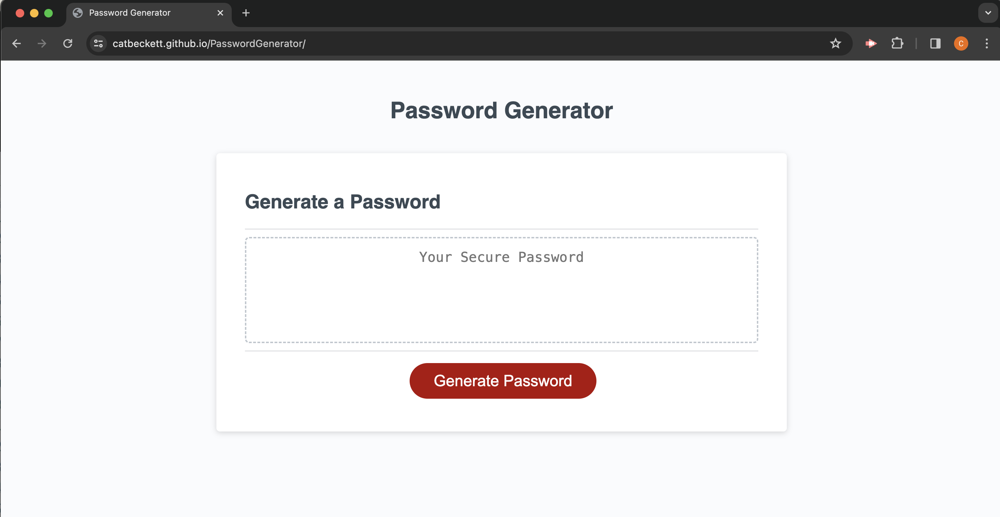
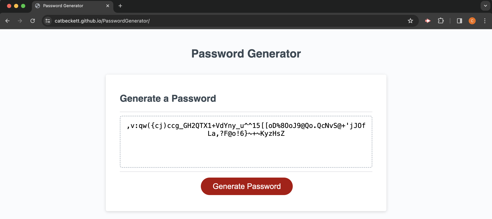

# Password Generator

This is a simple web application that allows users to generate a random password based on their selected criteria. The application runs in the browser and features dynamically updated HTML and CSS, powered by JavaScript code.

## Features

- **Password Criteria**: Users can specify the length of the password (between 8 and 128 characters) and choose which character types to include (lowercase, uppercase, numeric, and special characters).
- **Validation**: The application validates user input to ensure the password length meets the required criteria and at least one character type is selected.
- **Password Generation**: Upon user input validation, the application generates a random password based on the selected criteria.
- **Responsive UI**: The user interface is clean, polished, and responsive, ensuring it adapts to multiple screen sizes.

## How to Use

1. Open the `index.html` file in a web browser.
2. Specify the desired length of the password and select the character types to include by clicking the "Generate Password" button.
3. Follow the prompts to select password criteria.
4. Once all prompts are answered, the generated password will be displayed in the designated textarea.

## Technologies Used

- HTML
- CSS
- JavaScript

## License

This project is licensed under the MIT License.

